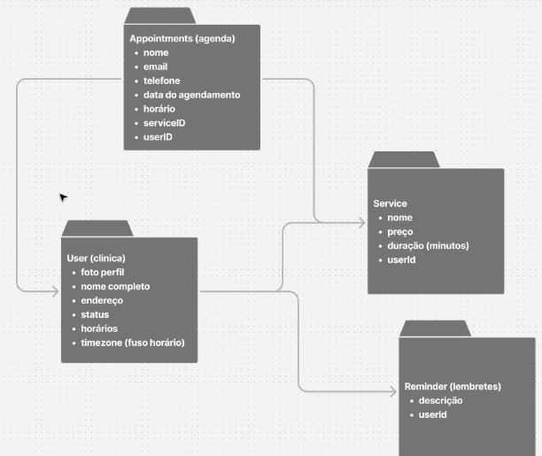

# OdontoPro

Sistema SaaS para gestão de clínicas odontológicas.

---

## 🚀 Funcionalidades

- Autenticação com Google
- Cadastro de pacientes
- Agendamento de consultas
- Painel administrativo
- Gestão de usuários

## Exemplos Visuais

### HomePage

### Diagrama de Entidade-Relacionamento

## 🛠️ Tecnologias

- Next.js (App Router)
- React
- TypeScript
- Prisma ORM
- PostgreSQL
- TailwindCSS
- shadcn/ui
- Zod